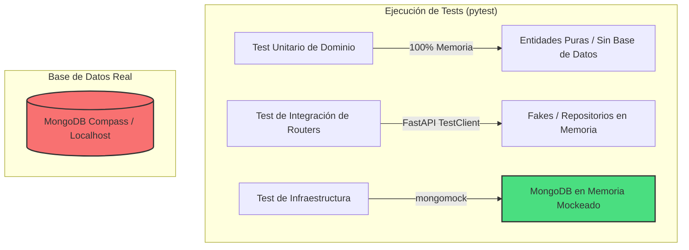

# Guía de Exposición Técnica: Arquitectura, Base de Datos, Tests y Errores

Esta guía está diseñada para preparar tu exposición oral y examen práctico, describiendo paso a paso el funcionamiento interno del proyecto, la interacción de sus componentes y cómo defender la arquitectura ante preguntas técnicas.

---

## 1. Cómo Levantar la Aplicación en Windows con MongoDB Local

### Requisitos Previos
1. **Python 3.13** instalado en Windows.
2. **MongoDB** instalado y ejecutándose como servicio en Windows (por defecto escucha en el puerto `27017`).
3. **MongoDB Compass** (interfaz gráfica oficial) instalado para inspeccionar visualmente los datos.

### Paso 1: Configurar las Variables de Entorno (`.env`)
Para que la aplicación se conecte a tu base de datos instalada localmente en Windows (en lugar de buscar el contenedor Docker), debes editar el archivo `.env` en la raíz del proyecto:

```ini
SECRET_KEY=clave-de-prueba-local-12345
MONGODB_URL=mongodb://localhost:27017
MONGODB_DB_NAME=mesa_de_ayuda
```
> [!NOTE]
> Al cambiar `mongodb://mongo:27017` por `mongodb://localhost:27017`, le indicamos a la librería `pymongo` que busque el motor de MongoDB corriendo nativamente en tu sistema Windows.

### Paso 2: Iniciar el Servidor de Desarrollo
Abre una terminal PowerShell o CMD en la raíz del proyecto y ejecuta:

1. **Activar el entorno virtual**:
   ```powershell
   .venv\Scripts\activate
   ```
2. **Iniciar la API con Uvicorn**:
   ```powershell
   uvicorn main:app --reload
   ```
   *El flag `--reload` detecta cambios en el código y reinicia el servidor automáticamente.*

### Paso 3: Acceder a la Interfaz y Documentación
* **Interfaz de Usuario (Frontend AdminLTE v4)**: Abre en tu navegador [http://localhost:8000/app/](http://localhost:8000/app/)
* **Documentación Interactiva de la API**: Abre [http://localhost:8000/docs](http://localhost:8000/docs) (Swagger UI) para probar endpoints individuales.
* **Diagramas de Arquitectura (UML)**: Abre [http://localhost:8000/uml/](http://localhost:8000/uml/)

---

## 2. Cómo Inspeccionar MongoDB y ver los Datos del Sistema

Para visualizar los usuarios y tickets cargados en tiempo real:

1. Abre **MongoDB Compass**.
2. En la pantalla de conexión, ingresa la URI: `mongodb://localhost:27017` y haz clic en **Connect**.
3. Verás una base de datos llamada `mesa_de_ayuda`.
4. Dentro de ella, encontrarás dos colecciones principales:
   * **`usuarios`**: Almacena los perfiles de usuario (Supervisor, Operador, Técnico, Solicitante) con sus claves hasheadas mediante `bcrypt`.
   * **`requerimientos`**: Almacena los requerimientos (tanto Incidentes como Solicitudes) modelados como un **Agregado**.

### El Concepto de Agregado en MongoDB
Explica esto en tu defensa para demostrar alto conocimiento de base de datos no relacionales:
> "En lugar de tener tres tablas separadas en una base de datos SQL (`requerimientos`, `comentarios` e `historial_eventos`) que requieren costosos `JOINs`, en MongoDB almacenamos todo como un **único documento atómico (Agregado)**. Los comentarios y los eventos de auditoría se guardan como subdocumentos embebidos (arreglos BSON). Esto garantiza consistencia atómica de escritura: cada vez que guardamos un ticket, sus comentarios e historial se escriben juntos en un solo ciclo de disco."

---

## 3. ¿Cómo Funcionan los Tests y cómo Interactúan con MongoDB?

El proyecto cuenta con **400 tests unitarios y de integración**. Es clave explicar cómo se conectan (o no) a la base de datos:



### 1. Aislamiento con `mongomock`
Si ejecutas los tests usando `pytest` en la terminal (`.venv\Scripts\pytest`), notarás que **no se guardan datos en tu base de datos local de Compass**. Esto se debe a que la capa de infraestructura usa `mongomock` para las pruebas del repositorio.
* **Por qué defender esto**: *"Los tests no deben depender de un estado externo o de que la base de datos local esté encendida. Usar un mock de MongoDB en memoria (`mongomock`) hace que las pruebas sean extremadamente veloces (400 tests en menos de 4 segundos) y repetibles en cualquier servidor de Integración Continua (CI/CD) sin configurar bases de datos."*

### 2. Mocking en Routers (`dependency_overrides`)
FastAPI provee la propiedad `app.dependency_overrides`. Durante los tests de los endpoints (en `tests/test_usuarios_router.py`), reemplazamos los repositorios reales de MongoDB por clases simuladas (`FakeRepositorioUsuario`). Esto nos permite validar los códigos de respuesta HTTP de los routers de forma totalmente aislada.

---

## 4. El Flujo de Control, DTOs (Pydantic) y Mitigación de Errores

En la defensa, te pedirán explicar cómo interactúan las capas ante un caso concreto. Usaremos el flujo de **Creación de un Incidente con Datos Inconsistentes** para ilustrarlo:

### Flujo ante una entrada inválida (Mitigación en Capa de Presentación)
Imagina que un usuario envía una petición para registrar un incidente, pero el campo `titulo` es demasiado corto (por ejemplo, `"A"`).

```
[Cliente HTTP] 
      │
      ▼  (POST /requerimientos/incidentes)
 [Router (FastAPI)] ──► Valida contra el DTO: IncidenteIn (Pydantic Schema)
      │
      ├─► Si es inválido (Ej: título de 1 caracter)
      │     └─► Retorna automáticamente: HTTP 422 Unprocessable Entity
      │
      ▼ (Datos Válidos de Entrada)
 [Servicio (Caso de Uso)] 
      │
      ▼
 [Dominio (Entidad Requerimiento)] ──► Evalúa Invariantes de Negocio (Ej: email corporativo)
      │                                   └─► Si hay error, lanza: UsuarioError / RequerimientoError
      │
      ▼ (Si pasa validaciones de negocio)
 [Repositorio (MongoDB)] ──► Serializa a documento BSON y graba en Base de Datos
```

### 1. El Rol de los DTOs (Pydantic)
Los archivos `schemas.py` actúan como **DTOs (Data Transfer Objects)**. Decoplan el modelo de red de las entidades internas.
* **DTO de Entrada (`IncidenteIn`, `UsuarioIn`)**: Valida que la estructura del JSON sea correcta antes de que toque la lógica de negocio.
* **DTO de Salida (`RequerimientoOut`, `UsuarioOut`)**: Filtra datos sensibles. Por ejemplo, al retornar un usuario, el DTO de salida jamás expone la contraseña hasheada, protegiendo la seguridad de la información.

### 2. Manejo de Errores y Mitigación de Inconsistencias
Cuando la estructura del JSON es correcta pero viola una **regla de negocio** (por ejemplo, intentar derivar un ticket a un técnico inactivo o que un operador asigne un email que no es `@comunicarlos.com.ar`):

1. **La Entidad de Dominio lanza un Error Semántico**: Por ejemplo, `UsuarioError("El email del operador debe ser corporativo")`.
2. **El error sube al Servidor**: Dado que no fue capturado en el Router, llega a los **Exception Handlers globales** configurados en `main.py`:
   ```python
   @app.exception_handler(UsuarioError)
   async def usuario_error_handler(request: Request, exc: UsuarioError) -> JSONResponse:
       return JSONResponse(
           status_code=status.HTTP_400_BAD_REQUEST,
           content={"detail": str(exc)},
       )
   ```
3. **Respuesta al Cliente**: El cliente recibe un claro `HTTP 400 Bad Request` con el mensaje exacto detallando qué regla de negocio violó.

### 3. Mitigación contra errores en la Base de Datos (ACL)
Un punto brillante para tu defensa es la mitigación de inconsistencias de datos usando una **Capa Anti-Corrupción (ACL)** en el repositorio:
> "Cuando recuperamos un documento de MongoDB, en lugar de usar un constructor público que podría disparar eventos de auditoría duplicados o validaciones innecesarias, el repositorio (`repo_requerimientos.py`) usa un mapeador privado que inyecta los valores directamente en los atributos privados de la entidad. Esto asegura que si la base de datos contiene registros históricos antiguos o parcialmente inconsistentes, no se rompa la aplicación al leerlos, aislando al Dominio de cualquier variación estructural en los documentos almacenados."
