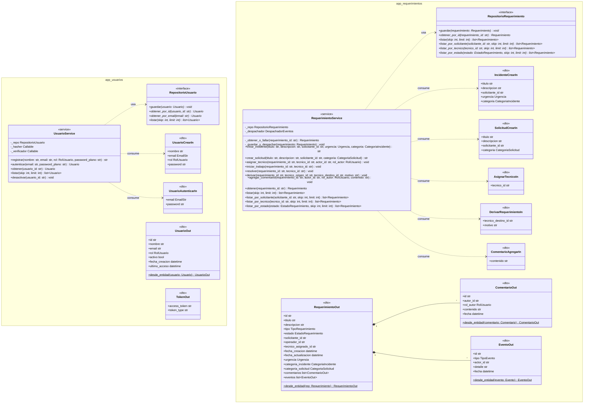

# Diagrama de Clases - Capa de Aplicación

Este diagrama modela detalladamente la capa de aplicación, abarcando los **Servicios de Aplicación** (casos de uso), los **Puertos / Interfaces de Repositorios** de los que dependen, y los **Schemas (DTOs)** utilizados para la entrada y salida de datos del sistema.

