# Diagrama de Clases - Capa de Dominio

Este diagrama modela detalladamente la capa de dominio de la aplicación, incluyendo las entidades principales, value objects, enumeraciones, interfaces y excepciones.

```mermaid
classDiagram
    direction TB

    %% Namespaces
    namespace compartido {
        class RolUsuario {
            <<enumeration>>
            SOLICITANTE
            OPERADOR
            TECNICO
            SUPERVISOR
        }
    }

    namespace usuarios {
        class Usuario {
            <<entity>>
            -str _id
            -str _nombre
            -str _email
            -RolUsuario _rol
            -str _password_hash
            -bool _activo
            -datetime _fecha_creacion
            -datetime _ultimo_acceso
            +desactivar() void
            +activar() void
            +registrar_acceso() void
        }

        class UsuarioError {
            <<exception>>
        }
        class UsuarioNoEncontrado
        class EmailDuplicado
        class CredencialesInvalidas
    }

    namespace requerimientos {
        class EstadoRequerimiento {
            <<enumeration>>
            ABIERTO
            ASIGNADO
            EN_PROGRESO
            RESUELTO
            REABIERTO
        }
        
        class TipoRequerimiento {
            <<enumeration>>
            INCIDENTE
            SOLICITUD
        }
        
        class Urgencia {
            <<enumeration>>
            CRITICA
            IMPORTANTE
            MENOR
        }
        
        class CategoriaIncidente {
            <<enumeration>>
            SERVICIO_INACCESIBLE
            BLOQUEO_SIM
            PERDIDA_O_DESTRUCCION_EQUIPO
        }
        
        class CategoriaSolicitud {
            <<enumeration>>
            ALTA_SERVICIO
            BAJA_SERVICIO
        }
        
        class TipoEvento {
            <<enumeration>>
        }

        class Comentario {
            -str _id
            -str _autor_id
            -RolUsuario _rol_autor
            -str _contenido
            -datetime _fecha
        }

        class Evento {
            -str _id
            -TipoEvento _tipo
            -str _actor_id
            -str _detalle
            -datetime _fecha
        }

        class Requerimiento {
            <<abstract>>
            -str _id
            -str _titulo
            -str _descripcion
            -EstadoRequerimiento _estado
            -str _solicitante_id
            -str _operador_id
            -str _tecnico_asignado_id
            -list~Comentario~ _comentarios
            -list~Evento~ _eventos
            -list~Evento~ _eventos_dominio
            -datetime _fecha_creacion
            -datetime _fecha_actualizacion
            +tipo()* TipoRequerimiento
            #_detalle_creacion()* str
            +recolectar_eventos() list~Evento~
            #_validar_transicion(nuevo_estado: EstadoRequerimiento) void
            #_registrar_evento(tipo: TipoEvento, actor_id: str, detalle: str) Evento
            +asignar_tecnico(tecnico_id: str, actor_id: str, rol_actor: RolUsuario) Evento
            +iniciar_trabajo(tecnico_id: str) Evento
            +resolver(tecnico_id: str) Evento
            +derivar(tecnico_origen_id: str, tecnico_destino_id: str, motivo: str) Evento
            +agregar_comentario(autor_id: str, rol_actor: RolUsuario, contenido: str) Comentario
        }

        class Incidente {
            <<entity>>
            -Urgencia _urgencia
            -CategoriaIncidente _categoria_incidente
            #_detalle_creacion() str
        }

        class Solicitud {
            <<entity>>
            -CategoriaSolicitud _categoria_solicitud
            #_detalle_creacion() str
        }

        class RequerimientoFactory {
            +crear_incidente(...) Incidente$
            +crear_solicitud(...) Solicitud$
        }

        class RequerimientoError {
            <<exception>>
        }
        class TransicionEstadoInvalida
        class OperacionNoAutorizada
    }

    namespace notificaciones {
        class ObservadorRequerimiento {
            <<interface>>
            +notificar(evento: Evento, requerimiento_id: str)* void
        }

        class DespachadorEventos {
            -list~ObservadorRequerimiento~ _observadores
            +registrar(observador: ObservadorRequerimiento) void
            +quitar(observador: ObservadorRequerimiento) void
            +despachar(evento: Evento, requerimiento_id: str) void
        }
    }

    %% Relaciones Usuarios
    UsuarioNoEncontrado <|-- UsuarioError
    EmailDuplicado <|-- UsuarioError
    CredencialesInvalidas <|-- UsuarioError
    Usuario ..> RolUsuario

    %% Relaciones Requerimientos
    Incidente <|-- Requerimiento
    Solicitud <|-- Requerimiento
    TransicionEstadoInvalida <|-- RequerimientoError
    OperacionNoAutorizada <|-- RequerimientoError
    Requerimiento "1" *-- "*" Comentario
    Requerimiento "1" *-- "*" Evento
    Requerimiento ..> EstadoRequerimiento
    Incidente ..> Urgencia
    Incidente ..> CategoriaIncidente
    Solicitud ..> CategoriaSolicitud
    RequerimientoFactory ..> Incidente
    RequerimientoFactory ..> Solicitud

    %% Relaciones Notificaciones
    DespachadorEventos "1" o-- "*" ObservadorRequerimiento
    ObservadorRequerimiento ..> Evento
```

