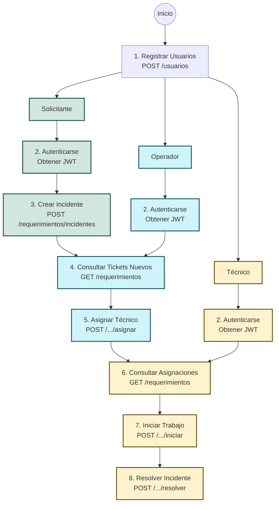
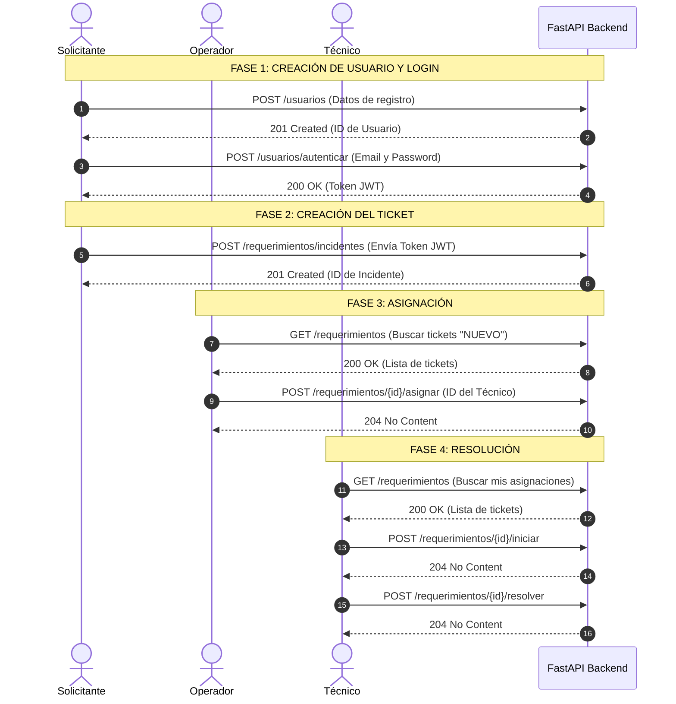
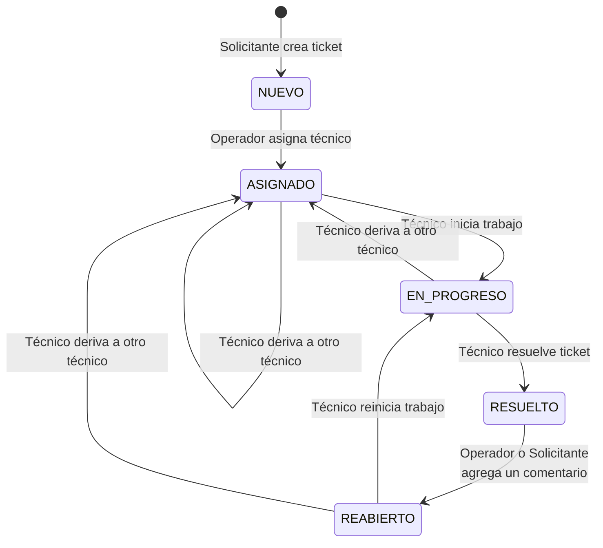

# Lógica de Negocio — Mesa de Ayuda

A continuación se presentan los diagramas de **Flujo**, **Secuencia** y **Estado** para comprender el ciclo completo de uso de la aplicación desde cero.

## 1. Diagrama de Flujo (Paso a Paso)

Este diagrama muestra los pasos generales que toman los distintos actores en el sistema desde que se crean las cuentas hasta que un ticket es resuelto.

## 2. Diagrama de Secuencia (Interacciones con la API)

Aquí puedes ver exactamente cómo interactúan los actores con los endpoints **GET** y **POST** de FastAPI a lo largo del tiempo.

## 3. Diagrama de Estados (Ciclo de Vida del Ticket)

El requerimiento pasa por transiciones de estado altamente controladas en el código (reglas de dominio). Solo ciertos roles pueden gatillar estas transiciones.

